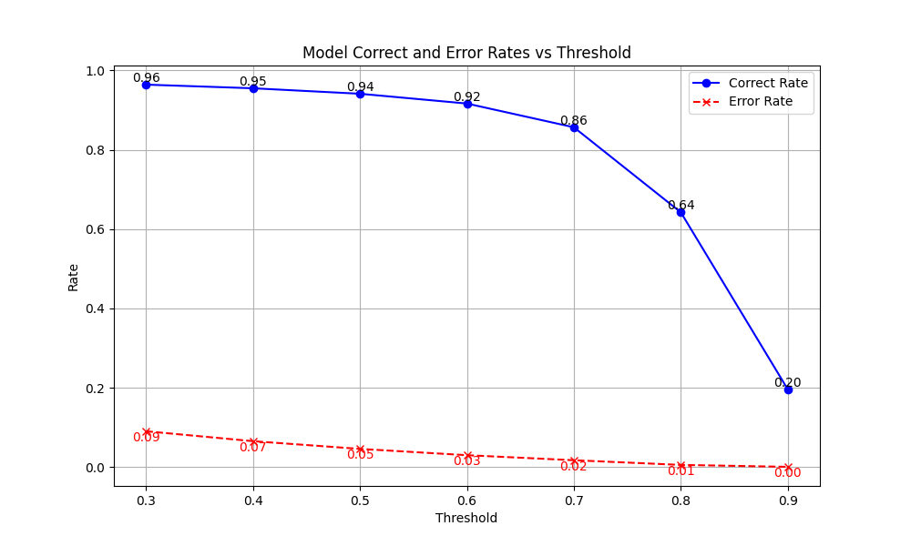

# YOLOv8_RKNN

## YOLO 模型的训练

创建并激活 conda 环境，安装 YOLO 官方库 ultralytics 及其他依赖。

```sh
$ pip install ultralytics
```

创建数据集，目录结构如下：

```
data
├── test
│   ├── images
│   └── labels
├── train
│   ├── images
│   └── labels
└── val
    ├── images
    └── labels
```

修改 mydata.yaml 中的字段：

```yaml
train: /path/to/data/train
val: /path/to/data/val
test: /path/to/data/test

# number of classes
nc: 4

# class names
names: ["class_0", "class_1", "class_2", "class_3"]
```

修改 train.py，参考[官方文档](https://docs.ultralytics.com/modes/train/)设置训练参数。

在 conda 环境下执行 python train.py，开始训练。

## 将 pt 模型导出为 onnx 模型

```sh
$ cd /path/to/ultralytics
```

修改 ./ultralytics/cfg/default.yaml 中 `model`项为 .pt 模型文件路径。

执行 python 脚本，生成 ONNX 模型：

```sh
$ export PYTHONPATH=./
$ python ./ultralytics/engine/exporter.py
```

## 将 onnx 模型转换为 rknn 模型

安装[rknn_toolkit2](https://github.com/airockchip/rknn-toolkit2.git)环境，python 验证`from rknn.api import RKNN`安装成功。

```sh
$ cd /path/to/onnx2rknn
```

执行 convert.py 脚本将 onnx 模型转换为 rknn 模型：

```sh
python convert.py onnx_model_path rk3588 fp output_rknn_path
```

## rknn 模型的 mAP 精度验证

需要在 rk3588 开发板上编译可执行文件并执行。

```sh
$ cd /path/to/rknn_val
$ mkdir build && cd build
$ cmake .. && make -j8
$ ./rknn_val <model_path> <data_path> <save_path>
```

model_path：rknn 模型路径  
data_path：数据集路径，目录下应包含 images 目录和 labels 目录，存放输入图像和对应的标签  
save_path：存放结果的 txt 文件路径

导出 txt 结果后，运行 runs/draw.py 脚本，绘制折线图。



## rknn 模型推理

同上，编译可执行文件后，运行 `./yolo_detect <model_path> <image_path>` 对单张输入图像进行检测，输出保存到 out.png。
